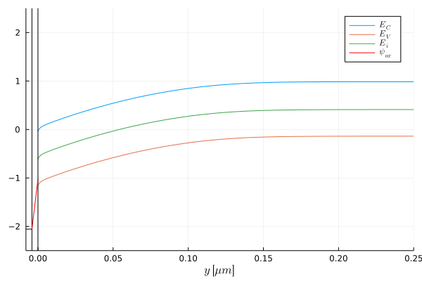
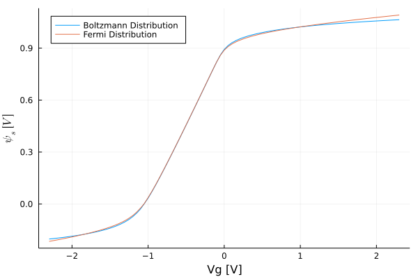
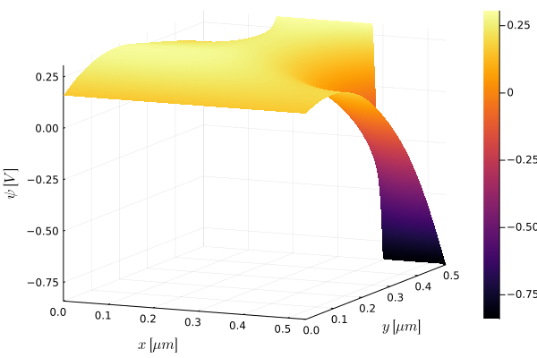
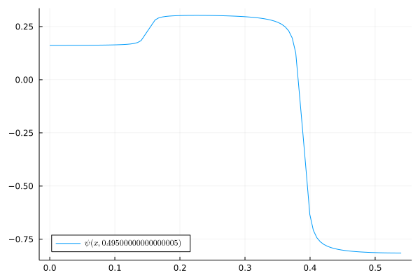
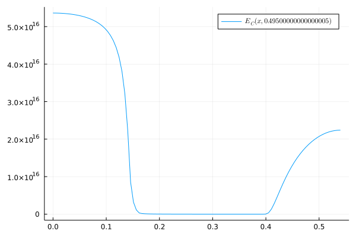
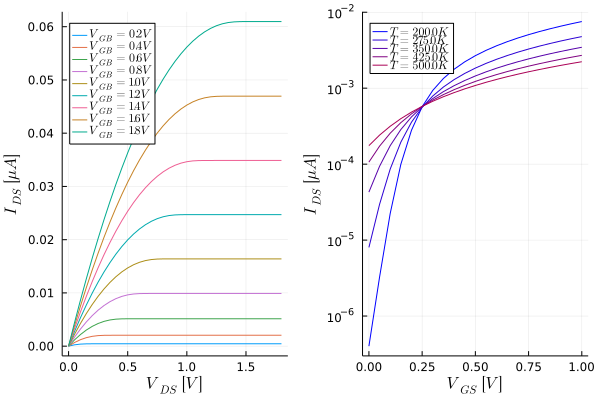
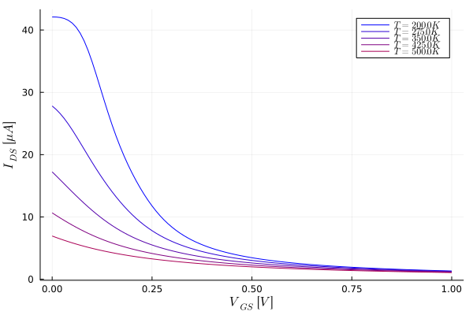

# MOSLab.jl
<!--
*** Thanks for checking out the Best-README-Template. If you have a suggestion
*** that would make this better, please fork the repo and create a pull request
*** or simply open an issue with the tag "enhancement".
*** Thanks again! Now go create something AMAZING! :D
***
***
***
*** To avoid retyping too much info. Do a search and replace for the following:
*** Rapos0, MOSLab.jl, twitter_handle, jrraposo1@gmail.com, MOSLab.jl, project_description
-->


<!-- PROJECT SHIELDS -->
<!--
*** I'm using markdown "reference style" links for readability.
*** Reference links are enclosed in brackets [ ] instead of parentheses ( ).
*** See the bottom of this document for the declaration of the reference variables
*** for contributors-url, forks-url, etc. This is an optional, concise syntax you may use.
*** https://www.markdownguide.org/basic-syntax/#reference-style-links
-->
[![Contributors][contributors-shield]][contributors-url]
[![Forks][forks-shield]][forks-url]
[![Stargazers][stars-shield]][stars-url]
[![Issues][issues-shield]][issues-url]
[![MIT License][license-shield]][license-url]


<!-- PROJECT LOGO -->
<br />

  ### MOSLab.jl

  From Semiconductor to TransistorLevel Modeling in Julia, including:
  
  1.	Material properties analysis of electronical characteristics using Fermi-Dirac distribution, Boltzmann-Maxwell distribution, and Blakemore distribution (at this stage limited to Silicon)
  2.	Numerical Simulations of MOS structures and MOS transistors in 1D and 2D powered by VoronoiFVM.jl
  3.	Implementation of industry and research standard MOSFET models (Pah-Sah, Brews, BSIM 6, PSP 103, UICM and EKV), with different mobility models.
  4. Circuit Level Simulation including DC operating Point, Transient analysys ( Powered by ModelingToolkit.jl ), Ac Analysis ( Powered By ControlSystems.jl ) 


<!-- GETTING STARTED -->
## Getting Started

To get a local copy up and running follow these simple steps.

### Prerequisites

A Julia instalation with version 1.6 or higher
### Installation
 ```julia
   ] add MOSLab
 ```


<!-- USAGE EXAMPLES -->
## Usage: MOS Cap Band Diagram
```julia
using MOSLab
using Plots
T = 300.0 # Temperature Kelvin
N_a = 5e18 # Bulk Doping in cm^-3
E_a = 0.044 #  The ground state energy of the acceptor in eV
t_ox = 4e-7 # oxide thickness in cm
t_si = 2.5e-5 # Silicon thickness
Vgv = 1.0 # Gate Voltage
PB = SemiconductorData(T,BoltzmanDist(),PSilicon(N_a,E_a))
MOS = MOSStructure(Alluminium(),SiO2(),PB,t_ox,t_si)
sol = PoissonVoronoi(Vgv,MOS,201)
BandDiagram(sol)
plot!(legend=:topright)
savefig("BandDiagram.png")
```

 ```julia
PBFermi = SemiconductorData(T,FermiDist(),PSilicon(N_a))
MOSFermi = MOSStructure(Alluminium(),SiO2(),PBFermi,t_ox,t_si)
plot(-2.3:0.05:2.3,x-> ψs(x,MOS),label="Boltzmann Distribution")
plot!(-2.3:0.05:2.3,x-> ψs(x,MOSFermi),label="Fermi Distribution",legend=:topleft)
xlabel!("Vg [V]")
ppsi = ylabel!(L"\psi_s \  [V]")
savefig("psi_comp.png")
 ```


## Usage: Simple 2D MOSFET Simulation 

 ```julia
   using MOSLab
    using Plots
    using LaTeXStrings
    Vg = 0.1 # Gate Voltage
    Vd = 1.0 # Dain Voltage
    Nx = 101 # Number of grid points on the x direction
    Ny = 101 # Number of grid points on the y direction
    N_d = 6e16 # Dopants density at the drain and source side  in cm ^-3
    T = 300.0 # Temperature in Kelvin
    Nb = 5.7e17 # Dopants ensity at the bulk in cm ^-3
    l = .180e-4 # Channel length
    h = 0.5e-4 # Silicon depth
    t_ox = 4e-7 # Oxide thickens in cm
    Ms = MOSFETInputDeck(N_d,Nb,T,l,h,h/2.0,l,t_ox,:NMOS) # Create the input deck for an NMOS transistor
    Vs = ψs_PSP(Vg,Ms.Gate) # Calculate the surface potential at the gate
    G,psi,nn,pp = MOSFETSimulation(Ms,Vs,Vd,Nx,Ny;verbose=false,ξ₀=0.01) # run 2D MOSFET simulation
    gr()
    X = unique(G[1,:])
    Y = unique(G[2,:])
    contour(X,Y,psi,fill=true)
    surface(G[1,:],G[2,:],psi,fill=true)
    xlabel!(L"x \ [\mu m]")
    ylabel!(L"y \ [\mu m]")
    plot!(zlabel = L"\psi \ [V]")
```
### Transitor Surface Potential at bias

 ```julia
    yvals = unique(G[2,:])
    ySel = G[2,:] .== yvals[end-1]
    sum(ySel)
    minimum(psi[ySel])
    plot(G[1,ySel],psi[ySel],label="\$ \\psi (x,$(yvals[end-1]) ) \$",legend=:bottomleft)
```
### Surface Potential Allong Channel

```julia
    savefig("Psi_channel.png")
    plot(G[1,ySel],nn[ySel],label="\$ E_C (x,$(yvals[end-1]) ) \$",legend=:topright)
    savefig("nn_channel.png")
   ```
## Electron Concentration Allong Channel

  
## Usage: Plot Id x Vd and Id Vg curve of an Mosfet using 

```julia
using MOSLab
using Plots
using LaTeXStrings
NpolyDoping = 5.5e17 # Gate Npoly doping concentration in cm^-3
N_a = 5.5e17 # Bulk doping concentration in cm^-3
E_a = 0.0# The ground state energy of the acceptor in eV
t_ox = 3.8e-7 # oxide thickness in cm
t_si = 1e-6
CList2 = reshape( range(colorant"blue", stop=colorant"red",length=7), 1, 7 );

MOSf(T) = MOSStructure(NPoly(NpolyDoping),SiO2(),SemiconductorData(T,BoltzmanDist(),PSilicon(N_a,E_a)),t_ox,t_si) ## Calculate Parameters of a MOS Structure the given parameters using Boltzman Distribution at temperature T 
transistor_model(T) = BSIM6Model(MOSf(T),1.0e-4,1.0e-4)
Idf(Vg,Vd,T) = Id(Vg,Vd,0.0,transistor_model(T)) ## Calculate the Current using the ACM Model of a transistor having the parameters from MOSf(T) and W =1.0 um, L = 1.0 um, similar contructors are available for the other models
plot()
for Vgv in 0.2:0.2:1.8
    plot!(0:0.05:1.8,x->1e6*Idf(Vgv,x,300.0),label="\$V_{GB} = $(Vgv) V\$") # plot Id, Vd characteristics for different VGB
end
PSPG = plot!(xlabel=L"V_{DS} \ [V]",ylabel=L"I_{DS} \ [\mu A]",legend=:topleft)

plot()
for (i,Tv) in enumerate(LinRange(200,500,5))
    plot!(0:0.05:1.0,x->1e6*Idf(x,0.1,Tv),label="\$T = $(Tv) K\$",linecolor=CList2[i]) # plot Id, Vg characteristics for different Temperatures
end
PSPD = plot!(xlabel=L"V_{GS} \ [V]",ylabel=L"I_{DS} \ [\mu A]",legend=:topleft,yaxis=:log10)
plot(PSPG,PSPD) # plot both graphs side by side 
savefig("TransistorCurves.png")
```

```julia
gmIdf(Vg,Vd,T) = gm(Vg,Vd,0.0,transistor_model(T))/Idf(Vg,Vd,T)
plot()
for (i,Tv) in enumerate(LinRange(200,500,5))
    plot!(0:0.01:1.0,x->gmIdf(x,0.1,Tv),label="\$T = $(Tv) K\$",linecolor=CList2[i]) # plot Id, Vg characteristics for different Temperatures
end
PSPD = plot!(xlabel=L"V_{GS} \ [V]",ylabel=L"I_{DS} \ [\mu A]",legend=:topright)
savefig("gmId.png")
```


## Circuit Simulation 
```julia
using Plots
using MOSLab


NpolyDoping = 5e17 # Gate Npoly doping concentration in cm^-3
N_a = 5e17 # Bulk doping concentration in cm^-3
E_a = 0.044 # The ground state energy of the acceptor in eV
t_ox = 4e-7 # oxide thickness in cm
t_si = 1e-6
MOSf(T) = MOSStructure(NPoly(NpolyDoping),SiO2(),SemiconductorData(T,BoltzmanDist(),PSilicon(N_a,E_a)),t_ox,t_si) ## Calculate Parameters of a MOS Structure the given parameters using Boltzman Distribution at temperature T 
g = 1
d = 2
s = 0
M1 = CircuitComponent("M1",ACMModel(MOSf(300.0),1000.0e-4,1.0e-4))
netT = Netlist()
addComponent(netT,M1,Dict("g"=>1,"d"=>d,"s"=>s))
addComponent(netT,CircuitComponent("Vg",VoltageSource(0.3)),Dict("p"=>g,"n"=>s))
addComponent(netT,CircuitComponent("Vd",VoltageSource(1.0)),Dict("p"=>d,"n"=>s))
ckt = Circuit(netT)
res = dc_op(ckt)
for i in 2:length(netT.nodes) # exclude ground
    println("$(netT.nodes[i].name): $(res[i-1])")
end
```
```julia
V_n1: 0.3
V_n2: 1.0
J_Vg: 0.0
J_Vd: -0.0005823007996463166
```

<!-- ROADMAP -->
## Roadmap

See the [open issues](https://github.com/Rapos0/MOSLab.jl/issues) for a list of proposed features (and known issues).


<!-- CONTRIBUTING -->
## Contributing

Contributions are what make the open source community such an amazing place to learn, inspire, and create. Any contributions you make are **greatly appreciated**.

1. Fork the Project
2. Create your Feature Branch (`git checkout -b feature/AmazingFeature`)
3. Commit your Changes (`git commit -m 'Add some AmazingFeature'`)
4. Push to the Branch (`git push origin feature/AmazingFeature`)
5. Open a Pull Request


<!-- LICENSE -->
## License

Distributed under the MIT License. See `LICENSE` for more information.


<!-- CONTACT -->
## Contact

João Roberto Raposo de Oliveira Martins - jrraposo1@gmail.com

Project Link: [https://github.com/Rapos0/MOSLab.jl](https://github.com/Rapos0/MOSLab.jl)


<!-- ACKNOWLEDGEMENTS -->
## Acknowledgements
* [VoronoiFVM.jl](https://github.com/j-fu/VoronoiFVM.jl)
* [ModelingToolkit.jl](https://github.com/SciML/ModelingToolkit.jl)
* [Pietro Maris Ferreira](https://github.com/DrPiBlacksmith)

[contributors-shield]: https://img.shields.io/github/contributors/othneildrew/Best-README-Template.svg?style=for-the-badge
[contributors-url]: https://github.com/Rapos0/MOSLab.jl/graphs/contributors
[forks-shield]: https://img.shields.io/github/forks/othneildrew/Best-README-Template.svg?style=for-the-badge
[forks-url]: https://github.com/Rapos0/MOSLab.jl/network/members
[stars-shield]: https://img.shields.io/github/stars/othneildrew/Best-README-Template.svg?style=for-the-badge
[stars-url]: https://github.com/Rapos0/MOSLab.jl/stargazers
[issues-shield]: https://img.shields.io/github/issues/othneildrew/Best-README-Template.svg?style=for-the-badge
[issues-url]: https://github.com/Rapos0/MOSLab.jl/issues
[license-shield]: https://img.shields.io/github/license/othneildrew/Best-README-Template.svg?style=for-the-badge
[license-url]: https://github.com/Rapos0/MOSLab.jl/blob/master/LICENSE.txt
[linkedin-shield]: https://img.shields.io/badge/-LinkedIn-black.svg?style=for-the-badge&logo=linkedin&colorB=555
[linkedin-url]: https://linkedin.com/in/othneildrew
